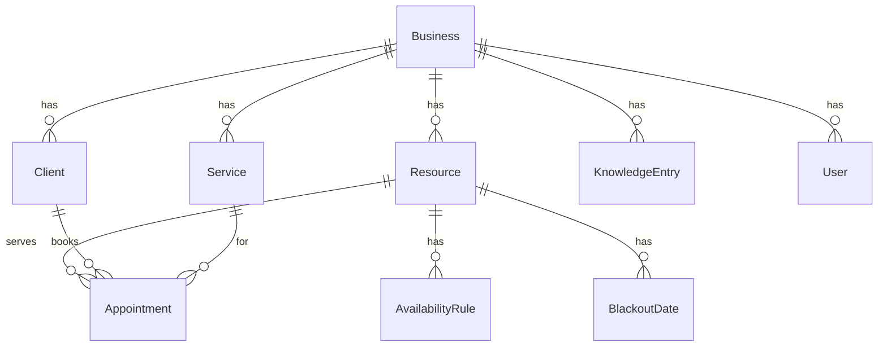

# Architecture — AI Voice & Chat Booking Concierge

This document describes the complete architecture of the assistant in
`apps/assistant`: a **multi-tenant AI voice + chat brand concierge and booking
assistant**, launched with the "Paws & Care" veterinary clinic as the first
tenant. It answers anything about the business and books / reschedules / cancels
appointments — by chat or voice, in the client's language, with a warm,
human-sounding persona.

- [1. Overview](#1-overview)
- [2. Tech stack](#2-tech-stack)
- [3. System architecture](#3-system-architecture)
- [4. Component breakdown](#4-component-breakdown)
- [5. Request flows](#5-request-flows)
- [6. Data model](#6-data-model)
- [7. AI concierge](#7-ai-concierge)
- [8. Voice](#8-voice)
- [9. Internationalization](#9-internationalization)
- [10. Email & notifications](#10-email--notifications)
- [11. Security architecture](#11-security-architecture)
- [12. Configuration](#12-configuration)
- [13. Deployment](#13-deployment)
- [14. Testing](#14-testing)
- [15. Extensibility & roadmap](#15-extensibility--roadmap)
- [16. Directory map](#16-directory-map)

---

## 1. Overview

**Design goals**

- **Zero-setup demo:** runs with no API keys and no database (in-memory seed +
  keyless concierge + browser voice), and progressively upgrades as keys/DB are
  added.
- **Provider-interfaced integrations:** the LLM, voice, email, and persistence
  all sit behind interfaces with safe fallbacks, so the app degrades gracefully
  and stays testable.
- **Hexagonal core:** the booking domain depends only on a `Repo` port, never on
  a framework or vendor, so business rules are pure and unit-tested.
- **Multi-tenant from day one:** every record is scoped to a `Business`; the
  active tenant is resolved by slug.

**Capabilities:** conversational booking (book/reschedule/cancel, conflict-free),
full brand concierge (location, hours, facilities, services, pricing, team),
warm human voice, multilingual, returning-client memory, no-medical-advice
safety, staff admin dashboard, light/dark UI, email confirmations & reminders,
Google Calendar sync (push events + free/busy).

## 2. Tech stack

| Layer | Choice |
|---|---|
| Framework | Next.js 16 (App Router) · React 19 · TypeScript |
| Styling | Tailwind CSS v4, CSS-variable design tokens (light/dark) |
| LLM | Anthropic Claude (tool use), model via `CLAUDE_MODEL` (default `claude-sonnet-4-6`) |
| Persistence | PostgreSQL via Prisma 6 (optional) — in-memory repo otherwise |
| Voice | ElevenLabs (server proxy) with Web Speech API fallback |
| Email | Resend (HTTP) with console-outbox fallback |
| Calendar | Google Calendar (OAuth2 refresh-token) with keyless no-op fallback |
| Validation | Zod on every API boundary |
| Tests | Vitest (43 specs) |
| Hosting | Vercel + managed Postgres (Neon/Supabase); Redis (future) |

## 3. System architecture

```mermaid
flowchart TB
  subgraph Browser
    W[Chat + Voice Widget]
    M[Marketing pages: Home / About / Contact]
    A[Staff Admin /admin]
  end

  subgraph Next["Next.js app (Vercel)"]
    direction TB
    R[Route Handlers /api/*]
    CV[Conversation Service\nlib/ai/concierge]
    TOOLS[Tools\nlib/ai/tools]
    DOM[Booking Domain\nlib/domain/*]
    REPO[(Repo port\nmemory | prisma)]
    EMAIL[Email\nlib/email]
    CAL[Calendar\nlib/calendar]
    VOICE[/api/tts proxy/]
  end

  subgraph External
    CLAUDE[Anthropic Claude]
    EL[ElevenLabs]
    RESEND[Resend]
    GCAL[Google Calendar]
    PG[(PostgreSQL)]
  end

  W -->|/api/chat, /api/bookings| R
  W -->|/api/tts| VOICE
  M -->|/api/contact| R
  A -->|/api/admin/*| R
  R --> CV --> CLAUDE
  CV --> TOOLS --> DOM --> REPO --> PG
  R --> DOM
  TOOLS --> EMAIL --> RESEND
  TOOLS --> CAL --> GCAL
  R --> EMAIL
  R --> CAL
  CAL -. free/busy .-> DOM
  VOICE --> EL
```

Key rule: **availability and bookings only ever come from the domain/DB** — the
LLM never invents times or confirms a booking without a successful tool call.

## 4. Component breakdown

**Frontend** (`app/`)

- `app/page.tsx` — landing + embedded `ChatWidget`.
- `app/about/page.tsx`, `app/contact/page.tsx` — themed marketing pages;
  `ContactForm` posts to `/api/contact`.
- `app/admin/page.tsx` — staff dashboard (sign in, list/reschedule/cancel).
- `app/components/ChatWidget.tsx` — chat + voice UI: message list, mic (STT),
  speaker toggle (TTS), service/slot chips, booking form (name/phone/email/pet).
- `app/components/{SiteNav,ThemeToggle,ContactForm}.tsx`.
- `app/layout.tsx` + `app/globals.css` — fonts, design tokens, no-flash theme
  script, class-based dark mode.

**API route handlers** (`app/api/`) — all `runtime = "nodejs"`, Zod-validated,
return a `{ data }` / `{ error: { code, message } }` envelope.

| Route | Purpose | Auth |
|---|---|---|
| `GET /business` | tenant meta (persona, branding, services, voiceProvider) | public |
| `POST /chat` | one concierge turn (SSE-ready JSON) | public, rate-limited |
| `GET /availability` | real open slots for a service | public |
| `POST /bookings` | structured, conflict-free booking + confirmation email | public, rate-limited |
| `GET /client/me` | resolve returning-client cookie → safe profile | cookie |
| `POST /contact` | contact message → clinic email | public, rate-limited |
| `POST /tts` | ElevenLabs synthesis proxy (streams mp3) | public, rate-limited |
| `POST /admin/login` · `/admin/logout` | staff session | password, rate-limited |
| `GET /admin/bookings` · `PATCH`/`DELETE /admin/bookings/:id` | manage bookings | cookie |
| `GET /admin/calendar` | Google Calendar sync status (for the dashboard badge) | cookie |
| `GET /cron/reminders` | ~24h reminder send | `CRON_SECRET` |

**Server libraries** (`lib/`) — domain, repos, AI, voice, email, calendar, i18n,
security (detailed in the sections below).

## 5. Request flows

**Chat booking**

1. Widget `POST /api/chat` with the message history.
2. `runConcierge` resolves any returning-client context (signed cookie), builds
   the per-tenant system prompt, and runs the Claude **tool loop** (or the
   keyless fallback).
3. Tools call the **booking domain** through the `Repo` port: `check_availability`
   returns real slots; `create_booking` writes the appointment conflict-free.
4. On success a confirmation email is queued, the booking is mirrored to the
   resource's Google Calendar (both best-effort), and a signed returning-client
   cookie is set.
5. Reply (and any UI hint — service/slot chips, booked card) returns to the
   widget; if voice is on, it's spoken.

**Voice booking** — identical brain. The widget adds mic capture → STT → the same
`/api/chat` turn → reply → TTS playback, with **barge-in** (speaking cancels
playback). STT/TTS language follow the detected conversation language.

**Returning client** — after a booking, an httpOnly signed cookie (`pc_uid`) holds
the client id. On return, `/api/client/me` (and `/api/chat`) resolve it to greet
by name and recall the pet and next visit.

**Admin reschedule** — `PATCH /api/admin/bookings/:id` loads the appointment within
the tenant, calls `rescheduleAppointment` (cancel old + create new at a free
slot), all conflict-checked.

## 6. Data model

PostgreSQL via Prisma (`prisma/schema.prisma`). Every tenant-owned row carries
`businessId`; vertical-specific fields (e.g. pets) live in flexible `Json`
columns so other verticals need no schema change.



- **Business** — tenant; `config` Json holds branding, hours, policies, the voice
  persona, and tone.
- **Service / Resource / AvailabilityRule** — what's bookable, with whom, and when
  (weekly rules; `BlackoutDate` for exceptions).
- **Client** — name, phone, email, `attributes.pets[]`.
- **Appointment** — `startsAt`/`endsAt`, `status` (PENDING/CONFIRMED/CANCELLED/…),
  `googleEventId` (the synced Google Calendar event), `attributes`. `Resource` carries
  `googleCalId` to target a specific calendar (§10).
- **KnowledgeEntry** — `kind` (FAQ/SERVICE/LOCATION/HOURS/PRICING/TEAM/…) + title/
  body/metadata; powers the concierge.
- **Conversation / Message** — transcript storage.

**Double-booking prevention (highest-risk path).** Two layers:

1. **Postgres exclusion constraint** (`prisma/constraints.sql`) — a `tstzrange`
   `EXCLUDE USING gist` per resource where `status <> 'CANCELLED'` makes
   overlapping active appointments physically impossible, even under concurrency.
2. **Application guard** — `createAppointment` runs an overlap check in a
   transaction (and the in-memory repo mirrors it). Verified by a concurrency
   unit test: N parallel bookings of one slot → exactly one wins.

**Repository port** (`lib/types.ts`) — domain and tools depend only on this
interface. `getRepo()` selects `PrismaRepo` when `DATABASE_URL` is set, else
`MemoryRepo` (a seeded clinic), so the app runs anywhere.

## 7. AI concierge

`lib/ai/concierge.ts` runs one turn:

- **System prompt** (`prompt.ts`) — per-tenant identity, persona/tone, brand
  facts, guardrails, returning-client block, and the **language rule** (mirror
  the client's language). The static portion is marked for **prompt caching**.
- **Tools** (`tools.ts`, agent-harness shape — narrow inputs, deterministic
  `{status, summary, data, next_actions}` outputs): `lookup_knowledge`,
  `lookup_client`, `list_services`, `check_availability`, `create_booking`,
  `reschedule_booking`, `cancel_booking`, `escalate_to_human`.
- **Loop** — Claude plans, calls typed tools, results feed back until a final
  message; UI hints (service/slot/booked) are surfaced to the widget.
- **Keyless fallback** (`fallback.ts`) — when `ANTHROPIC_API_KEY` is unset, an
  intent-based responder uses the same tools so the demo is fully interactive
  (brand answers, slot offers, returning-client greeting, cross-language
  emergency detection).

**Guardrails:** never state availability/prices without a tool result; **never
give medical advice** — reassure + book the soonest visit or escalate/share the
emergency line; honest AI disclosure; confirm only after `create_booking`
succeeds. Cost control via model routing + prompt caching.

## 8. Voice

`lib/voice/` provides a unified layer:

- `speakReply()` prefers **ElevenLabs** (warm, soft female voice, tuned settings,
  `eleven_turbo_v2_5` multilingual) and automatically falls back to the browser
  **Web Speech** voice; `stopAllSpeech()` gives barge-in.
- TTS is synthesized **server-side** via `POST /api/tts` (keeps the key secret;
  streams mp3; returns 501 when unconfigured so the client falls back).
- STT uses the browser SpeechRecognition API; recognizer + TTS voice follow the
  conversation language (`toBCP47`).
- `/api/business` reports `voiceProvider` so the widget knows which path to use.

## 9. Internationalization

`lib/lang.ts` — dependency-free language **detection** (Latin-word heuristics +
script ranges for hi/zh/ar/ru/ja), BCP-47 mapping, and a localized **phrase
dictionary** (en/es/fr/de/pt/hi). With Claude, replies are fully translated via
the prompt rule; the keyless fallback localizes its own phrasing and the
**no-medical-advice safety line**. Voice STT/TTS follow the detected language.

## 10. Email & notifications

`lib/email.ts` — sends via **Resend** (plain `fetch`, no SDK) when
`RESEND_API_KEY` is set, otherwise logs to a console **outbox** and returns ok, so
flows work and are testable with zero setup. HTML-escaped, branded templates for:

- **Booking confirmation** — sent from `/api/bookings` and the chat
  `create_booking` tool (best-effort; never blocks a booking).
- **Contact notification** — `/api/contact` emails the clinic inbox.
- **Reminder** — `GET /api/cron/reminders` (guarded by `CRON_SECRET`, idempotent)
  sends to appointments ~24h out; wire to a scheduler (e.g. Vercel Cron).

External sends happen **outside** DB transactions (Prisma timeout trap) and never
fail the originating request.

### Calendar sync

`lib/calendar/` mirrors bookings to **Google Calendar** and folds each resource's
external commitments into the offered times, following the same provider pattern
as voice/email — pure, unit-tested request builders (`google.ts`) with thin
`fetch` wrappers, plus a keyless **no-op fallback** so the app runs with zero
setup.

- **Auth:** OAuth2 refresh-token grant. The business connects one Google account
  that owns/shares the resource calendars; we exchange its refresh token for
  short-lived access tokens server-side (cached in-process). All calls are
  server-side `fetch`, so no CSP change and the credentials never reach the browser.
- **Lifecycle (best-effort, never blocks a booking):** `onBookingCreated` pushes
  an event and persists its id to `Appointment.googleEventId`; `onBookingRescheduled`
  removes the old event and creates a new one; `onBookingCancelled` deletes it.
  Wired into `/api/bookings`, the `create_booking`/`reschedule_booking`/`cancel_booking`
  tools, and the admin `PATCH`/`DELETE` routes.
- **Free/busy:** `check_availability` queries each resource's calendar over the
  search window and passes the busy intervals to `getAvailableSlots`, which skips
  any candidate that overlaps — so we never offer a time the vet is busy elsewhere.
- **Per-resource calendars:** `Resource.googleCalId` targets a specific calendar
  (else `GOOGLE_CALENDAR_ID`, default `primary`). The staff dashboard shows a
  "Calendar sync on/off" badge via `GET /api/admin/calendar`.

## 11. Security architecture

- **Staff auth** (`lib/admin-auth.ts`) — shared password gate; httpOnly +
  `SameSite=Strict` session cookie; constant-time comparisons.
- **Fail-closed secrets** (`lib/secret.ts`) — in production the app refuses
  guessable defaults: `getServerSecret()` throws and the admin password is
  disabled unless `ADMIN_SECRET`/`ADMIN_PASSWORD` are set. The returning-client
  cookie uses `getOptionalSecret()` and **degrades gracefully** (skips the cookie
  rather than breaking the public booking flow).
- **Security headers / CSP** (`next.config.ts`) — CSP (tuned for the theme script,
  fonts, inline styles, and audio blobs), `X-Frame-Options: DENY`, `nosniff`,
  `Referrer-Policy`, `Permissions-Policy` (mic=self for voice, others denied),
  HSTS; `X-Powered-By` removed.
- **Rate limiting** (`lib/rate-limit.ts`) — fixed-window per-IP on chat (30/m),
  tts (40/m), bookings (15/m), contact (5/m), admin login (10/5m brute-force).
  Per-instance for the MVP; a shared store (Redis) is the production swap.
- **Tenant isolation** — every repo method is `businessId`-scoped; production adds
  Postgres RLS as defense-in-depth.
- **Input validation** — Zod at every API boundary; all DB access is parameterized
  via Prisma (no string SQL); React auto-escaping (no user-data `dangerouslySetInnerHTML`).

A `/security-review` pass found and remediated one issue (default-secret admin
session forgery) — now fail-closed.

## 12. Configuration

All via environment variables (`.env.example`). Everything optional except where
noted; unset integrations fall back safely.

| Var | Effect |
|---|---|
| `BUSINESS_SLUG` | active tenant (default `paws-and-care`) |
| `ANTHROPIC_API_KEY` / `CLAUDE_MODEL` | enables Claude (else keyless fallback) |
| `DATABASE_URL` | enables Postgres (else in-memory) |
| `ELEVENLABS_API_KEY` / `_VOICE_ID` / `_MODEL` | production voice (else Web Speech) |
| `RESEND_API_KEY` / `EMAIL_FROM` / `CLINIC_EMAIL` | real email (else outbox) |
| `GOOGLE_CLIENT_ID` / `GOOGLE_CLIENT_SECRET` / `GOOGLE_REFRESH_TOKEN` / `GOOGLE_CALENDAR_ID` | Google Calendar sync + free/busy (else no-op) |
| `CRON_SECRET` | guards the reminder endpoint |
| `ADMIN_SECRET` / `ADMIN_PASSWORD` | **required in production** for admin |

## 13. Deployment

- **Vercel** for the Next.js app; route handlers run on the Node runtime.
- **Managed Postgres** (Neon/Supabase): `npm run db:push && npm run seed`; apply
  `prisma/constraints.sql` for the overlap exclusion constraint. Use
  `connection_limit=1` (+ pooler) for serverless.
- **Vercel Cron** → `GET /api/cron/reminders?key=$CRON_SECRET` hourly.
- **Secrets** as Vercel env vars; set `ADMIN_SECRET`/`ADMIN_PASSWORD` before go-live.

## 14. Testing

43 Vitest specs (`npm test`), no external services required:

- **Domain** — availability derivation, conflict-free booking, **concurrency**
  double-booking, reschedule/cancel.
- **Concierge fallback** — brand answers, slot offers, no-medical-advice, and
  multilingual phrasing.
- **i18n** — language detection + localization.
- **Voice** — ElevenLabs request builder (warm settings).
- **Email** — outbox fallback + template building/escaping.
- **Calendar** — request/free-busy builders, event mapping, keyless no-op
  fallback, and free/busy folding into the offered slots.
- **Security** — rate limiter, admin auth, fail-closed secrets.

Plus lint (`eslint`) and a production `next build` typecheck gate on every change.

## 15. Extensibility & roadmap

- **New tenant/vertical:** add a `Business` row with its config, services, hours,
  staff, and knowledge — no code change. Per-vertical fields go in `Json`.
- **Embeddable widget:** the chat widget is self-contained and brand-themed for
  multi-site embedding (a fast-follow once `frame-ancestors` is relaxed per host).
- **Google Calendar sync** is implemented (push/reschedule/cancel events +
  free/busy in the offered slots; see §10). Two-way sync (a push-notification
  channel that ingests externally-created events) is the natural next step.
- **Remaining roadmap:** waitlist/cancellation fill, `.ics` invites, analytics,
  shared-store rate limiting, and Auth.js for per-staff admin roles.

## 16. Directory map

```
apps/assistant/
├── app/
│   ├── page.tsx · about/ · contact/ · admin/      # pages
│   ├── components/ChatWidget · SiteNav · ThemeToggle · ContactForm
│   ├── api/                                        # route handlers
│   │   ├── business · chat · availability · bookings · client/me
│   │   ├── contact · tts · cron/reminders
│   │   └── admin/{login,logout,bookings,bookings/[id],calendar}
│   ├── layout.tsx · globals.css                    # theming
├── lib/
│   ├── types.ts                                    # domain types + Repo port
│   ├── domain/{availability,booking,client-context,time}.ts
│   ├── repo/{index,memory,prisma}.ts               # persistence
│   ├── ai/{concierge,tools,prompt,fallback,types}.ts
│   ├── calendar/{index,google}.ts                  # Google Calendar sync + free/busy
│   ├── voice/{index,webspeech,elevenlabs,elevenlabs-server}.ts
│   ├── email.ts · lang.ts                          # notifications + i18n
│   ├── admin-auth.ts · client-session.ts · secret.ts · rate-limit.ts
│   └── context.ts · prisma.ts
├── prisma/{schema.prisma,constraints.sql,seed.ts}
└── next.config.ts · .env.example · README.md · ARCHITECTURE.md
```

For the original product plan and phased roadmap, see
`/root/.claude/plans/now-i-give-all-stateless-pudding.md`.
